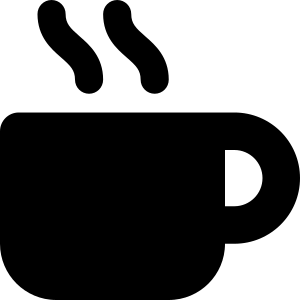
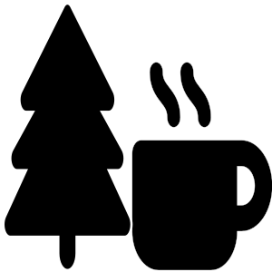

```{r setup, include=FALSE}
knitr::opts_chunk$set(echo = FALSE)
```

Almost every year I participate in the [Coffeeneuring Challenge]. You can find out more what coffeeneuring is and check out my past adventures over on my [bike blog](http://ride-or-pie.blogspot.com/search/label/coffeeneuring). But basically you have to bike to seven different coffee locations over the course of about six weeks. Now that the 2022 season is over, it seemed like a good opportunity to use my coffeeneuring data for the [#30DayMapChallenge](https://30daymapchallenge.com/).

```{r}
library(googlesheets4)
library(tidyverse)
library(tmap)
library(tmaptools)
library(sf)
library(extrafont)
```

First we read in the spreadsheet where I kept track of my rides and destinations. 


```{r read-destinations}
destinations <- read_sheet("https://docs.google.com/spreadsheets/d/1QaZ0BPOxJs-wUg0LMardUEjCvDd8h6GUirUl4VOzBDU/edit?usp=sharing") |> 
    separate(coordinates, into = c("lon", "lat"), sep = ", ", convert = T) |> 
    st_as_sf(coords = c("lat", "lon"))

destinations |> 
  kableExtra::kable()
```

We can map the destinations:

```{r map-destinations}
tmap_mode("view")
tm_shape(destinations) +
  tm_dots("category")
```

You may wonder about the one dot very far south. This was on a very long two-day ride to Illinois I did in October!

Next we add lines for the actual rides to these destinations. I don't have access to the Strava API, and so I manually downloaded the `gpx` files and saved them in a folder. We use `purrr` to read them in and simplify the tracks with `st_simplify` to reduce the size.


```{r get-tracks}
process_gpx <- function(x){
  df <- read_GPX(x)
  df[[1]] |> #read_GPX outputs list
    st_simplify(dTolerance = 100) #distance is in meters
}

tracks <- list.files("data/", full.names = T) |> 
  map_dfr(process_gpx)
```

Let's add the tracks to the above map:

```{r map-tracks}
  tm_shape(destinations)+
  tm_dots("category") +
  tm_shape(tracks) + 
  tm_lines()
```

We have all the data elements together now. Let's create a nice static map. For that we need a base map. The [Stamen Watercolor](http://maps.stamen.com/watercolor/) is always a nice option. Note the `+c(...)` after the bounding box command: This enlarges the bounding box  in each direction so that our destinations aren't at the very edge of the map and to make the map a little more square.

```{r get-basemap}

basemap <- read_osm(bb(destinations)+c(-.3, -.1, .3, .1), 
                    zoom = 10, 
                    type = "stamen-watercolor")

```

Rather than using color to distinguish between the category of destination, we can use custom icons with the `tmap_icons()` function. I created two icons in Inkscape, based on Fontawesome icons. 

{width=25%}
{width=25%}

Now it's just a matter of putting all the layers together and making adjustments:

```{r static-map, layout="l-body-outset", preview=TRUE}
my_icons <- tmap_icons(c("img/coffee-inside.png", "img/coffee-outside.png"))

tmap_mode("plot")
tm_shape(basemap) +
  tm_rgb() +
  tm_shape(tracks) +
  tm_lines(lwd = 1.5, 
           col = "darkgreen") +
  tm_shape(destinations) +
  tm_symbols(
    shape = "category",
    shapes = my_icons,
    size = .1,
    title.shape = "Type of destination",
    border.col = NULL,
    alpha = .8
  ) +
  tm_text(
    "name",
    size = .5,
    remove.overlap = T,
    col = "white",
    just = "left",
    bg.color = "darkgrey",
    bg.alpha = .7
  ) +
  tm_compass() +
  tm_layout(
    legend.outside = T,
    main.title = "Harald’s 2022 Coffeeneuring Season",
    fontfamily = "Roboto Condensed"
  )
```
