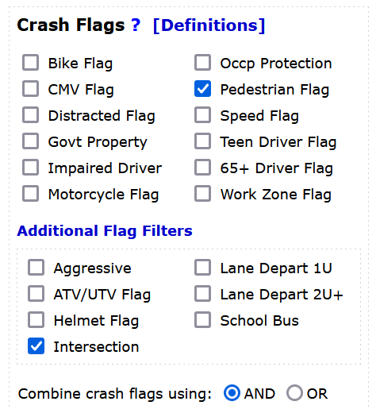

```{r setup, include=FALSE}
knitr::opts_chunk$set(echo = FALSE)
```

There are some efforts underway to no longer allow right turns on red in Madison.
For people walking and biking, right-turning motor vehicles pose a threat, as is demonstrated in [this video](https://www.youtube.com/watch?v=AhLZXqmP9fw) of an intersection where I myself recently had a very close call. Other cities in the US, such as Washington (DC) or cambridge (MA) are in the process of eliminating right turns on red.

For our local effort, I offered to help with some crash data analysis. It is difficult to determine how many crashes can be directly attributed to right on red, we can at least answer the question: How many crashes involving people walking and biking occur at signalized intersections?

# Crash data

Crash data is available from [Community Maps](https://transportal.cee.wisc.edu/partners/community-maps/crash/search/BasicSearch.do) the statewide crash data reporting portal.
For registered users, one of the available filters is for "intersection" crashes.
We start by downloading all crashes in the City and Town of Madison that have an intersection flag as well as the bicycle or pedestrian flag.

{width="50%"}

```{r}
library(tidyverse)
library(sf)
library(tmap)
tmap_mode("view")


ped_crashes <- read_csv("data/crash-records.csv")
bike_crashes <- read_csv("data/crash-records(1).csv")
all_crashes <- rbind(ped_crashes, bike_crashes)

all_crashes <- all_crashes |> 
  mutate(bike_ped = case_when(
    PEDFLAG == "Y" ~ "ped",
    BIKEFLAG == "Y" ~ "bike"
  ),
  severity = case_when(
    INJSVR == "K" ~ "Fatality",
    INJSVR == "A" ~ "Serious injury",
    INJSVR == "B" ~ "Minor injury",
    INJSVR == "C" ~ "Possible injury",
    INJSVR == "O" ~ "No injury"
  ),
  severity = factor(severity, 
                    levels = c("Fatality",
                               "Serious injury",
                               "Minor injury",
                               "Possible injury",
                               "No injury"))
  )

```

Mapping the crashes shows that something weird is going on:

```{r}
tm_shape(st_as_sf(all_crashes, coords = c("LONGITUDE", "LATITUDE")))+
  tm_dots()
```

Crashes in the middle of the ocean?
No: Crashes that were not geocoded and therefore have coordinates of 0,0.
I looked up the crash reports for all these and manually added coordinates:

```{r}

#manually fix locations of one unmapped crash
all_crashes[all_crashes$DOCTNMBR == "01L0245X0S",]$LATITUDE <- 43.08952868325321
all_crashes[all_crashes$DOCTNMBR == "01L0245X0S",]$LONGITUDE <- -89.48608767371645

all_crashes[all_crashes$DOCTNMBR == "01L0245WX5",]$LATITUDE <- 43.0608101752285
all_crashes[all_crashes$DOCTNMBR == "01L0245WX5",]$LONGITUDE <- -89.50257794338208

all_crashes[all_crashes$DOCTNMBR == "01L0FV1GG7",]$LATITUDE <- 43.05027679273423
all_crashes[all_crashes$DOCTNMBR == "01L0FV1GG7",]$LONGITUDE <- -89.4000044121047

all_crashes[all_crashes$DOCTNMBR == "01L048CTMJ",]$LATITUDE <- 43.059824781314845
all_crashes[all_crashes$DOCTNMBR == "01L048CTMJ",]$LONGITUDE <- -89.40061771700978

all_crashes[all_crashes$DOCTNMBR == "01L0245WVQ",]$LATITUDE <- 43.03278427434284
all_crashes[all_crashes$DOCTNMBR == "01L0245WVQ",]$LONGITUDE <- -89.4597152111326

all_crashes[all_crashes$DOCTNMBR == "01L048CTLT",]$LATITUDE <- 43.07325624571523
all_crashes[all_crashes$DOCTNMBR == "01L048CTLT",]$LONGITUDE <- -89.40242558562917

all_crashes[all_crashes$DOCTNMBR == "01L0CR2KRW",]$LATITUDE <- 43.07325624571523
all_crashes[all_crashes$DOCTNMBR == "01L0CR2KRW",]$LONGITUDE <- -89.40242558562917

all_crashes[all_crashes$DOCTNMBR == "01L0W78HMJ",]$LATITUDE <- 43.06057645635835
all_crashes[all_crashes$DOCTNMBR == "01L0W78HMJ",]$LONGITUDE <- -89.50293626341433

all_crashes[all_crashes$DOCTNMBR == "01L0245WSZ",]$LATITUDE <- 43.0831299001578
all_crashes[all_crashes$DOCTNMBR == "01L0245WSZ",]$LONGITUDE <- -89.47595215839556

all_crashes[all_crashes$DOCTNMBR == "01L05QT5LB",]$LATITUDE <- 43.114230724048014
all_crashes[all_crashes$DOCTNMBR == "01L05QT5LB",]$LONGITUDE <- -89.35812769493853

all_crashes[all_crashes$DOCTNMBR == "01L06ZV8W2",]$LATITUDE <- 43.07322351699731
all_crashes[all_crashes$DOCTNMBR == "01L06ZV8W2",]$LONGITUDE <- -89.40072273726425

all_crashes[all_crashes$DOCTNMBR == "01L0CS9M1F",]$LATITUDE <- 43.04172765662615
all_crashes[all_crashes$DOCTNMBR == "01L0CS9M1F",]$LONGITUDE <- -89.39313149033856

all_crashes[all_crashes$DOCTNMBR == "01L0TS2DB6",]$LATITUDE <- 43.06769902424961
all_crashes[all_crashes$DOCTNMBR == "01L0TS2DB6",]$LONGITUDE <- -89.4008236046175

all_crashes[all_crashes$DOCTNMBR == "01L07LCTM4",]$LATITUDE <- 43.04634165079267
all_crashes[all_crashes$DOCTNMBR == "01L07LCTM4",]$LONGITUDE <- -89.48893584984673

# not 100% sure about this one; description kinda confusing
all_crashes[all_crashes$DOCTNMBR == "01L06KHWV6",]$LATITUDE <- 43.033329627105026
all_crashes[all_crashes$DOCTNMBR == "01L06KHWV6",]$LONGITUDE <- -89.40788999291192

all_crashes[all_crashes$DOCTNMBR == "01L0TS2D8H",]$LATITUDE <- 43.06202954006571
all_crashes[all_crashes$DOCTNMBR == "01L0TS2D8H",]$LONGITUDE <- -89.40412105286146


all_crashes_sf <- st_as_sf(all_crashes, coords = c("LONGITUDE", "LATITUDE"))
```

We map again to make sure it looks good:

```{r}
tmap_mode("plot")
tm_shape(all_crashes_sf) +
  tm_dots("bike_ped", size = 1)

```

# Signalized intersections

The City's open data portal has [intersection controls for all intersections in the county](https://data-cityofmadison.opendata.arcgis.com/datasets/cityofmadison::intersection-control/).
Signalized intersections are coded `SL`.

```{r}

intersection_control <- st_read("data/Intersection_Control.geojson")

signals <- intersection_control |> 
  filter(IntControl == "SL")
```

Now we create a 50-meter buffer[^1] around the signal locations and only keep crashes within that buffer:

[^1]: 50 meters is based on some trial and error with different buffer sizes.
    Too small and you risk undercounting (e.g. crashes at large intersections); too big a buffer, and you may attribute crashes at a nearby unsignalized intersection to the signalized one.

```{r}

st_crs(all_crashes_sf) <- 4326


crashes_at_signals <- all_crashes_sf[st_within(all_crashes_sf, st_buffer(signals, dist = 50)) %>% lengths > 0,]

```

Now we can map all crashes at signalized intersections, separated into bike and bike crashes:

## Bike crashes at signalized intersections

```{r layout="l-body-outset", preview=TRUE}
popup_vars <- c("DOCTNMBR", "bike_ped", "severity", "ACCDDATE","ACCDHOUR","ONRDWY","ONRDWYDIR","ATRDWY","INTDIS","INTDIR","TOTFATL","TOTINJ","TOTVEH","MNRCOLL","ACCDTYPE","AGGRFLAG","BUSFLAG","CMVFLAG","CONSZONE","DISTRCTD","IMPAIRED","INTRFLAG","LANEDP1U","LANEDP2U","SPEEDFLAG","TEENDRVR","65+DRVR")

tmap_mode("view")
tm_shape(crashes_at_signals |> filter(bike_ped == "bike")) +
  tm_dots("severity",
          popup.vars = popup_vars) +
  tm_layout(main.title = "Bike intersection crashes")
```
## Ped crashes at signalized intersections
```{r layout="l-body-outset"}
tm_shape(crashes_at_signals |> filter(bike_ped == "ped")) +
  tm_dots("severity",
          popup.vars = popup_vars) +
  tm_layout(main.title = "Pedestrian intersection crashes")
```

Some summary statistics.
Overall, there were `r nrow(all_crashes)` intersection crashes involving people walking and biking between January 2012 and now.
Out of those, `r nrow(crashes_at_signals)` (`r round(nrow(crashes_at_signals)/nrow(all_crashes)*100, 0)`%) happened at signalized intersections. These are the numbers of all intersection crashes, grouped by ped/bike and injury severity:

```{r}
all_crashes |> 
  group_by(bike_ped, severity) |> 
  tally() |> 
  gt::gt()
```

And here are the ones at signalized intersections only:

```{r}
crashes_at_signals |> 
  st_drop_geometry() |> 
  group_by(bike_ped, severity) |> 
  tally() |> 
  gt::gt()
```
