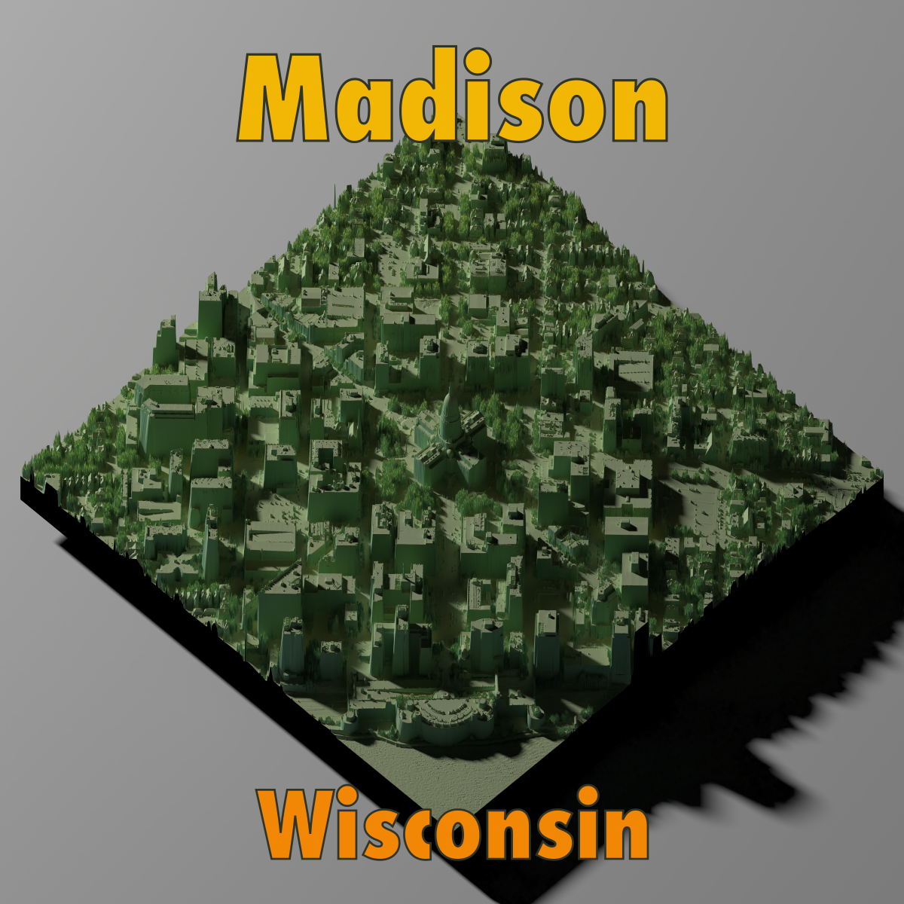

Over the past few months I have worked on producing 3D map visualizations with the amazing [`rayshader`](https://www.rayshader.com/) package. My motivation was to produce animated renderings of a route on a multi-day bike trip through Alps. I'll have to write more about those maps at another time. In the meantime, you can check out the results as part of my YouTube videos on the trip: https://www.youtube.com/watch?v=3rYSDXiv_Aw&t=28s

The `rayshader` package has a lot of functions and parameters, and the data you feed into the package often needs a lot of pre-processing. My work on the Alps maps got me to a point where I feel somewhat confident in the overall process. And so when I stumbled upon [a dataset](https://geodata.wisc.edu/catalog/67d0518f-d029-4d8f-a8ac-41d9138fb30d) of digital surface model (DSM) data, I decided to turn it into something pretty. The City of Madison has a very, very high-resolution DSM dataset of the city. The DSM was created in 2022 [by flying a plane equipped with LIDAR over the city](https://lio.danecounty.gov/services/flydane/projects).

Let's start with the final result:


Click [here](output/madison 3d.png) to get the full 16 MB 5000x5000px image.

# Load packages
In addition to  `rayshader`  itself we need a few more packages for data preparation: The `sf` package for dealing with geodata, `terra` for handling raster data, and `purrr`.

```{r load-packages, eval=FALSE}
library(sf)
library(terra)
library(purrr)
library(rayshader)
```


# Read and combine data
The data is made available in small tiles that you have to combine to produce a rendering of an area as large as downtown. Given Madison's geography, it made sense to focus on the Wisconsin State Capitol as the center of the map. I downloaded the tiles around the Capitol manually and saved them all in one folder.^[To reproduce the image, you'll need tiles 346, 347, 348, 385, 386, 387, 426, 427, and 428.]  


```{r eval=FALSE, read-mosaic}
ele_files <- list.files("data/msn_img/", pattern = "Madison", full.names = TRUE)
walk(ele_files, ~ unzip(., exdir = "data/msn_img/msn_ele/"))
ele_list <- map(list.files("data/msn_img/msn_ele/", full.names = TRUE), ~ rast(.))
ele_mosaic <- exec("mosaic", !!!ele_list)
```

The code takes the list of zip files, unzips all of them into one filder, and then reads them in as a list of rasters. Those rasters are then combined into one large mosaic.

You could go on to create the 3D map with this mosaic already. But it wouldn't be centered on the Capitol. Let's fix that. 

```{r eval=FALSE, crop-to-capitol}
capitol <- st_point(c(-89.384167, 43.074722))
capitol_sf <- st_sfc(capitol, crs = "EPSG:4326")
capitol_proj <- st_transform(capitol_sf, "EPSG:3293")
capitol_buf <- st_buffer(capitol_proj, 3000) |> st_transform(st_crs(ele_mosaic))
ele_mosaic_cropped <- crop(ele_mosaic, capitol_buf)
```

I took to Wikipedia to look up the coordinates of the Capitol. You turn those coordinates into an `sf` object and then project it to an CRS with a length unit of meters. Then I created a 3000 meter buffer around the Capitol. Why 3000 meters? That involved some trial and error to make sure the tiles of the mosaic had enough coverage in each direction. Next the buffer gets projected into the CRS of the mosaic data, and then we're ready to crop the mosaic to the extent of the buffer.

Because the data is so detailed, I strongly recommend aggregating the data while you're fine tuning the output. Once you're happy with how things look, you re-run the code without the aggregation. This will save you a lot of waiting for the code to run.

```{r eval=FALSE, optional-aggregation}
ele_mosaic_agg <-  ele_mosaic_cropped |> aggregate(16)
```

Now we're almost ready to create the plot. The `plot_3d()` function from `rayshader` expects a matrix as its input:

```{r raster-to-matrix, eval=FALSE}
ele_matrix <- raster_to_matrix(ele_mosaic_agg)
```

Time to create the map! There are a ton more options to experiment with, but I kept it pretty basic. Aside from changing the viewing angle `phi` and the colors of the background, I mostly stuck with the defaults. Note that if you use aggregated data, you have to adjust the `zscale` accordingly. The full data has a scale of 1; and if you aggregate, for example, by 16, you'd have to set the `zscale` value to 16 to avoid exaggeration of the elevation.

```{r plot, eval=FALSE}
plot_3d(hillshade = sphere_shade(ele_matrix), heightmap = ele_matrix,
        zscale = 1, #set to your level of aggregation
        windowsize = 2400,
        solidcolor = "black",
        background = "black",
        phi = 30
        )
```

This command now opens an `rgl` window and you can interactively zoom and pan until you're happy with how things look.

I zoomed in a bit but otherwise left things as is. Now you can render a high-quality version to a file. For the light source, I wanted a late afternoon feel. I looked up the sun angle and direction at this time of year at 5:30 pm on https://www.timeanddate.com/astronomy/usa/madison, resulting in a direction of 257 and an angle of 20 degrees. The output size of 5000 by 5000 pixels is about the limit of what my Macbook Pro with 36 GB of RAM can handle and rendering at 128 samples probably took 45 minutes. As you're optimizing your end result, reduce the resolution and set the number of samples to 1.

```{r render, eval=FALSE }
render_highquality(filename = "output/ele_north_all_downtown.png", 
                   lightdirection = c(257),
                   lightaltitude = 20,
                   height = 5000,
                   width = 5000,
                   samples=128)
```

While you can add text to your 3D render right within `rayshader`, I added the text after the rendering in Inkscape. And that's all for today.