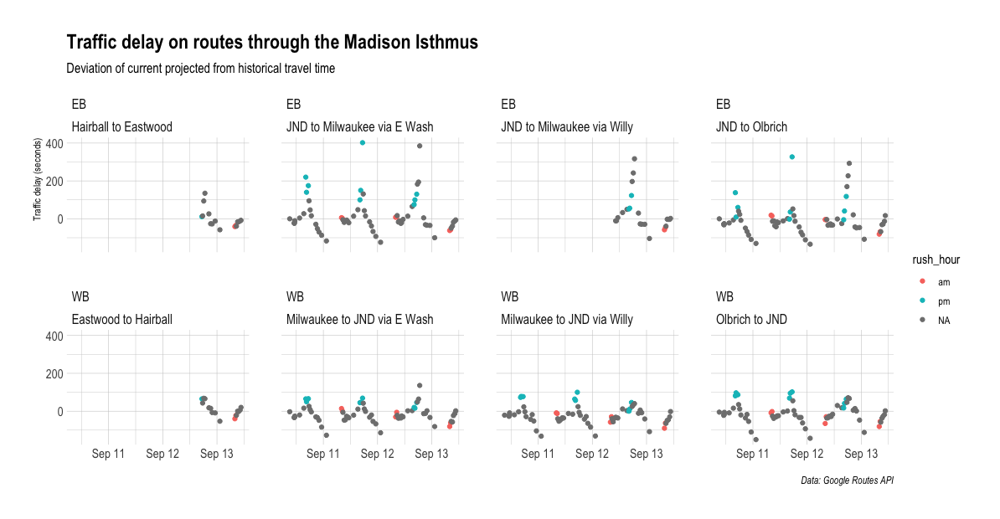

The City of Madison just started [a traffic trial](https://www.cityofmadison.com/news/2025-09-05/city-of-madison-to-test-removal-of-williamson-street-peak-hour-travel-lanes-to): Williamson Street is a local street on the east side of the isthmus. It has seen [some high-profile crashes](https://www.wortfm.org/mother-fools-crash-renews-calls-for-action/) in which drivers ended up crashing their cars into buildings. It also more generally has a higher crash rate than comparable city streets. The street has one travel lane and one curb lane in each direction. The curb lane is used for car parking for most of the day, except during rush hour: During those times parking was prohibited and it became an additional travel lane. In response to the crashes and community requests, the city has changed this on a trial basis: During the trial the curb lanes will remain parking lanes at all times. No more rush hour travel lanes.

To assess the impact of these changes, city staff are collecting various kinds of data, including car travel time data on the street itself and on parallel roads. As this is a low-budget and quickly implemented trial, there are limitations to how extensive the data collection is going to be. Specifically for travel time data, it sounded like city staff are manually going to use Google Maps to collect some point-in-time data.

What if we could automate and scale this process? Well, we can! The routing functions used on the Google Maps website can also be accessed programmatically through Google's [Routes API](https://console.cloud.google.com/apis/library/routes.googleapis.com). The API has a fairly generous free tier, allowing up to ten thousand queries a month. I wrote an R script that queries the API for a few relevant routes and returns the travel time at the time of query (as well as some additional variables). The script is then set up to run via GitHub Actions at 20 different time points throughout the day and the data is written to a [`pins`](https://pins.rstudio.com/) board. At the end of the trial (or at any point during it), I can export the data as a spreadsheet for analysis. 

The idea only occurred to me a day after the trial had already started, and so I don't have pre-trial data to compare with. However, the API does return a variable for the "ETA for the route considering only historical traffic information." And city staff did collect some pre-trial data as well. 

The code is not the prettiest. But it works. I offered the data to city traffic engineering staff, as well as modifying the time points and routes obtained to align with their pre-trial data collection. The code is available here: https://github.com/vgXhc/willy_street

# Early results and issues
The action has been running for a few days now and so I had time to inspect the results. One obvious issue is that I set up one of the route's from/via/to points incorrectly. An easy fix and there are still plenty of days left to collect data for that particular route. The other issue is not as easy a fix. As described above, I use a set schedule in Github Action to run the queries. However, Github Actions does not guarantee that an action will be run right at the time it is requested. Looking at when things were supposed to be run and at the timestamps in the data, there are significant deviations. Rather than having data for 7:30, 8, and 8:30 am, I have data for 8, 8:28, and 8:41 am. And so on. Github's server loads are probably higher on full hours and at certain UTC times, and so the delay is not consistent across the day. It should, however, be consistent across days.

I started writing analysis code to visualize the traffic delay, defined as the difference between the estimated time for the trip compared to historical trip times. Here's a quick chart:

More to come as I have more data and time to write additional [analyses](https://github.com/vgXhc/willy_street/blob/main/analysis.R).
