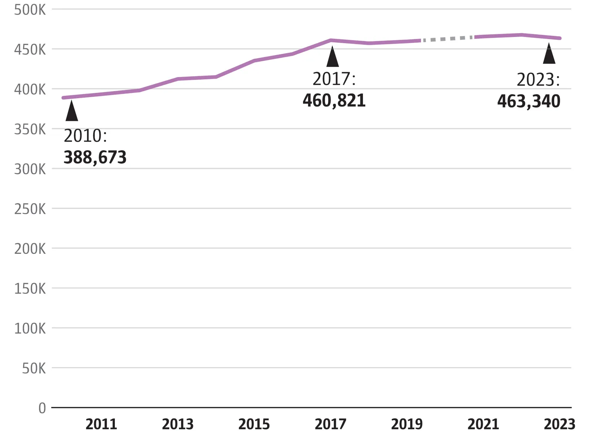

```{r setup, include=FALSE}
knitr::opts_chunk$set(echo = FALSE)
library(tidyverse)
library(tidycensus)
library(hrbrthemes)
library(ggtext)
```

I recently came across an interesting analysis of [changes in car ownership over time in Seattle](https://www.seattletimes.com/seattle-news/data/as-seattle-grew-the-number-of-cars-here-has-barely-budged-since-2017/) by data journalist Gene Balk. His main graph shows that the total numbers of cars in Seattle households has mostly held steady since 2017:



I have looked at household car ownership in a different way [previously](https://haraldkliems.netlify.app/posts/2024-02-29-where-are-the-4-car-households/) and was immediately curious what the numbers of Madison would be. So I recreated Balk's graph with Madison data. I included a slightly longer time span, as American Community Survey data is easily available going back to 2006. 


```{r retrieve-car-data, echo=FALSE}
get_cars <- function(year) {
  cars <- get_acs(geography = "place", 
                    variables = "B25046_001", 
                    year = year, 
                    state = "Wisconsin", 
                    survey = "acs1")
  cars |> filter(NAME == "Madison city, Wisconsin") |> 
    mutate(year = year) |> 
             rename(estimate_cars = estimate)
}

madison_cars <- map(c(2006:2019, 2021:2024), get_cars) |> list_rbind()
```

```{r plot-car, layout="l-body-outset", fig.width=10, fig.height=7}
madison_cars |> 
  ggplot(aes(year, estimate_cars)) +
  geom_line() +
  geom_point() +
  scale_y_continuous(limits = c(0, 190000), name = "Number of cars",labels = scales::label_number_auto()) +
  scale_x_continuous(name = element_blank()) +
 theme_ipsum() +
  labs(title = "<span>The number of cars in Madison households has grown from 136k in 2007 to 188k in 2024</span>",
       subtitle = "<span>Periods of stagnating or shrinking car ownership (2009-14, 2017-19) alternate with periods of growth (2007-09, 2014-17, 2021-24), most recently during and after the COVID-19 pandemic</span>",
       caption = "Data: American Community Survey, table B25046<br>No data available for 2020. Margins of error not shown.<br>Visualization: Harald Kliems") +
  theme(plot.subtitle = element_textbox_simple(padding = margin(5.5, 5.5, 5.5, 5.5),
      margin = margin(0, 0, 5.5, 0)),
        plot.title = element_textbox_simple(padding = margin(5.5, 5.5, 5.5, 5.5),
      margin = margin(0, 0, 5.5, 0)),
        plot.caption = element_markdown()) +
  annotate("text", x = 2007, y = 115000, label = "2007\n132k cars") +
  annotate("text", x = 2024, y = 165000, label = "2024\n188k cars")
  
```

The long-term trends look different from Seattle: We have periods of growth interspersed with periods when car ownership stays flat. The last growth spur started during the COVID-19 pandemic and hasn't ended yet (at least by 2024, the latest year for which American Community Survey data is available). 

Balk's article briefly mentions the metric of cars per 100 households (Seattle has more than New York City), but he doesn't present those numbers over time. Let's do that for Madison to put car ownership in perspective with our city's overall growth. First, how has the number of households changed?

```{r households, layout="l-body-outset", fig.width=10, fig.height=7}
get_households <- function(year) {
  hh <- get_acs("place", 
          year = year,
          variables = "B11001_001", 
          state = "Wisconsin", 
          cache_table = TRUE,
          survey = "acs1")
  hh |> 
    filter(NAME == "Madison city, Wisconsin") |> 
    mutate(year = year) |> 
    rename(estimate_hh = estimate)
}

madison_hh <- map(c(2006:2019, 2021:2024), get_households) |> list_rbind()

madison_hh |> 
  ggplot(aes(year, estimate_hh)) +
  geom_line() +
  geom_point() +
  scale_y_continuous(name = "Households",
                     limits = c(0, NA),
                     labels = scales::label_number_auto()) +
  scale_x_continuous(name = element_blank()) +
 theme_ipsum() +
  labs(title = "<span>Between 2006 and 2024, the number of households in Madison grew by about 42,000, or 46% </span>",
       # subtitle = "<span>In 2015, there were 151 cars per 100 households in Madison; in 2024 there were 141 car/100 hh</span>",
       caption = "Data: American Community Survey, table B11001<br>No data available for 2020; margins of error not shown<br>Visualization: Harald Kliems") +
  theme(plot.subtitle = element_textbox_simple(padding = margin(5.5, 5.5, 5.5, 5.5),
      margin = margin(0, 0, 5.5, 0)),
        plot.title = element_textbox_simple(padding = margin(5.5, 5.5, 5.5, 5.5),
      margin = margin(0, 0, 5.5, 0)),
        plot.caption = element_markdown())
```

Madison has grown a lot since 2006, and the growth in households has only accelerated in recent years. In 2024, our city had about 134,000 households, or 46% more than there were in 2006. So we have a growing number of cars and a growing numbers of households. Let's put the two together and calculate the rate of car ownership by households.

```{r car-per-hh-plot, layout="l-body-outset", fig.width=10, fig.height=7}
madison_hh |> 
  left_join(madison_cars, by = join_by(year, NAME, GEOID)) |> 
  mutate(cars_per_100hh = estimate_cars/estimate_hh*100) |> 
  ggplot(aes(year, cars_per_100hh)) +
  geom_line() +
  geom_point() +
  scale_y_continuous(name = "Cars per 100 households",
                     limits = c(0, 155)) +
  scale_x_continuous(name = element_blank()) +
 theme_ipsum() +
  labs(title = "<span>The number of cars per households started declining after its peak in 2015</span>",
       subtitle = "<span>In 2015, there were 151 cars per 100 households in Madison; in 2024 there were 141 cars/100 hh</span>",
       caption = "Data: American Community Survey, tables B25046, B11001<br>No data available for 2020; margins of error not shown<br>Visualization: Harald Kliems") +
  theme(plot.subtitle = element_textbox_simple(padding = margin(5.5, 5.5, 5.5, 5.5),
      margin = margin(0, 0, 5.5, 0)),
        plot.title = element_textbox_simple(padding = margin(5.5, 5.5, 5.5, 5.5),
      margin = margin(0, 0, 5.5, 0)),
        plot.caption = element_markdown())


```

We see that car ownership per 100 households has remained fairly constant, with roughly 150 cars per 100 households from 2006 to 2017. More recently, the numbers are a bit lower, closer to 140 cars per 100 households. Households aren't having more cars, and it's primarily the growth in households that is driving the increase in the number of cars in our city.

Madison's growth is unlikely to slow down any time soon, and to make that growth sustainable, it will be important to slow down the growth of car ownership per household. Cars require space to be stored and there are many externalities associated with that store: It raises the cost of housing (a underground parking garage spot can easily add $50,000 to the cost of construction), competes with other uses of the right-of-way, such as sidewalks, bike lanes, outdoor seating, or delivery zones, and [parked cars significantly increase the heat island effect in cities](https://phys.org/news/2025-08-cars-cities-significantly-contributing-urban.html). 
