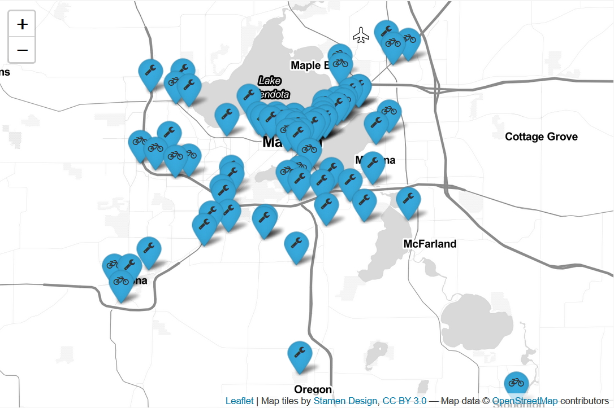
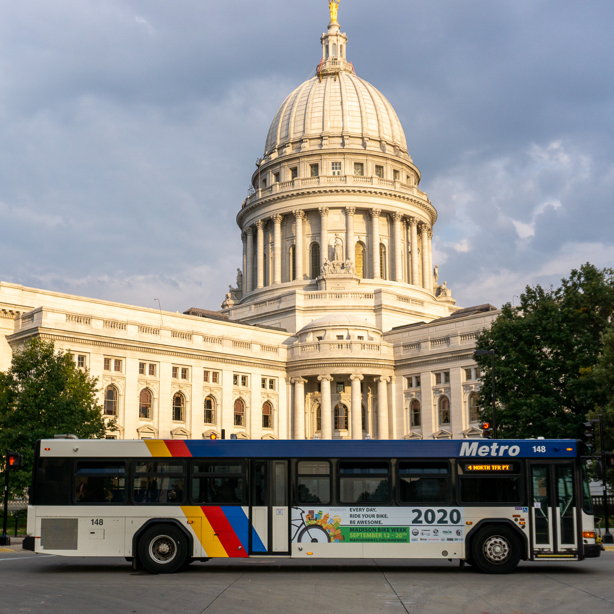

# Madison Bikes

I co-founded this local bike advocacy org back in 2015 and have been it's board president since 2019. I have learned so, so much along the way and have no regrets about the countless hours that went into this. Some Madison-Bikes-adjacent projects are listed below.

# Cyclists of Madison

[Cyclists of Madison](https://twitter.com/cyclists_of_msn) is a Twitter bot that posts portraits of people riding bikes in Madison. The idea behind the project is that there are many stereotypes and misconceptions about who does and doesn't ride bikes in Madison. While I'm an okay photographer and had a large pool of relevant photos, my programming skills were not good enough to take this from an idea to an actual bot. Fortunately, Ben Sandee took care of the coding part. It has some neat features, such as keeping track of which photos have already been posted, automatic resizing, and posting seasonally appropriate photos when available. The code is [available here](https://github.com/madisonbikes/cyclists_of_msn) under an open license. I'd love to see more Cyclists of ... accounts. Follow the bot on [Twitter](https://twitter.com/cyclists_of_msn)

# Madison bike shop and repair station map

When the COVID-19 pandemic struck, bike shops were in high demand, but many had to temporarily close, change their hours, or the way they operate. Madison Bikes board member Heather Pape [started a simple spreadsheet](https://www.madisonbikes.org/2020/03/is-my-local-bike-shop-still-open/), keeping track on Madison bike shops and their status. I turned that spreadsheet in an interactive web map, and later we partnered with the Wisconsin Bike Fed to take the project statewide. At this point, [the map](https://www.madisonbikes.org/bike-shop-map/) is focused on Dane County again and in addition to all bike shops includes outdoor bike repair stations (taken from the City of Madison Open Data portal). [Code for the map](https://github.com/vgXhc/madison_bike_shop_map) is using R Markdown with the `leaflet` and  `googlesheets` libraries. 

# Ride or Pie!?

I've been bike blogging for over a decade. Sometimes more, sometimes less. [Ride or Pie?!](http://ride-or-pie.blogspot.com/) is where that's happening.

# Tracking the Madison Bikes bus

For Madison Bike Week in 2020 Madison Bikes paid for a big ad on the side of a Metro bus. I built [a simple Shiny app](https://vgxhc.shinyapps.io/bus_tracker/) to track the bus so that I could stalk it and take pretty pictures:

Since then, I have kept expanding the app, where now it allows you to track any Metro bus(es) based on their vehicle ID(s).